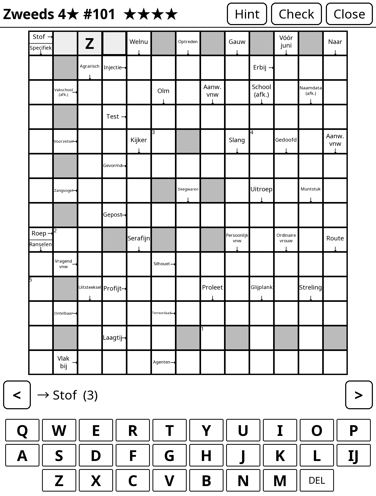

# KORreaderSP

**Arrowword puzzles (Swedish-style crosswords, "Zweedse puzzels") for e-readers running [KOReader](https://koreader.rocks).**

An arrowword is a crossword where the clues are written inside the grid, with
an arrow pointing at the answer. They are hugely popular in the Netherlands,
Germany and Scandinavia, and they suit an e-ink screen well: one page, no
scrolling, no time pressure.

This project has two halves:

- **`arrowword.koplugin/`**: a KOReader plugin (Lua) that shows puzzles and lets you solve them by touch.
- **`generator/`**: a Python generator that builds the puzzles, plus the word lists and hand-written clues it draws from.

<p align="center">
  
</p>

<!-- Photo of the puzzle on a Kobo Forma: save it as docs/img/photo-kobo-forma.jpg and
     uncomment the block below.
<p align="center">
  
</p>
-->

## Status

Working and in daily use on one device. Dutch puzzles only, for now.

| | |
|---|---|
| Plugin | grid with clue cells and arrows, QWERTY letter bar (with `IJ` for Dutch), check, hint, progress saved per puzzle, packs shown as folders, English and Dutch UI |
| Generator | five difficulty levels, deterministic per seed, validator for the puzzle format |
| Dutch data | 5,374 words with 13,542 hand-written clues; up to four stars only those words are used |
| Puzzles | 50 four-star puzzles in `puzzles/packs/nl/4-star-01/`, samples in `puzzles/samples/` |
| Languages | Dutch (`nl`). English (`en`) is planned; the format and tools are language-aware. See [CONTRIBUTING.md](CONTRIBUTING.md). |

## Tested device, and why your screen matters

Everything has been tested on a **Kobo Forma** (8 inch, 1440 x 1920 pixels,
300 ppi, Kobo firmware 4.38, KOReader v2026.03). That is the only device we
can vouch for.

An arrowword puts its clues *inside* the cells, so cell size decides whether
the puzzle is readable. The plugin makes the cells as large as the screen
allows, which means the same puzzle has smaller cells on a smaller screen:

- On the Forma a 13 x 14 grid gives cells of about 103 px, or 8.7 mm. That reads comfortably.
- Our first attempt, 13 x 18, gave 83 px (7 mm) cells on the same screen. The tester's verdict: just too small.

So grids are shaped like the screen's working area, and smaller screens need
smaller grids. [docs/DEVICES.md](docs/DEVICES.md) explains the layout, lists
the devices we expect to work with estimated cell sizes, and says which grid
sizes to pick. If you try another device, please tell us how it went.

## Install

You need a touch-screen e-reader with KOReader installed.

1. Copy `arrowword.koplugin/` to the `plugins/` folder of KOReader (on a Kobo: `.adds/koreader/plugins/`).
2. Copy puzzle folders to `arrowwords/` next to it (on a Kobo: `.adds/koreader/arrowwords/`). Sub-folders show up as packs.
3. Restart KOReader. Open the top menu, tap the tools icon and choose **Arrowword puzzles**.

On macOS with a Kobo connected over USB, `tools/deploy-kobo.sh` does steps 1 and 2.

**Playing:** tap a cell or a clue to select a word; tap the same letter cell
again to switch between across and down. The current clue is shown large under
the grid. **Check** marks wrong letters, **Hint** fills in one letter.

## Generate puzzles

Python 3.10 or newer, no packages needed.

```bash
python3 generator/generate.py --lang nl --stars 4 --count 10 --seed 1 --out puzzles/my-pack
python3 generator/validate.py puzzles/my-pack/*.json
```

The same seed always gives the same puzzle. Difficulty sets the vocabulary and
the grid size; see [generator/README.md](generator/README.md).

## Repository layout

```
arrowword.koplugin/   KOReader plugin (Lua)
generator/            puzzle generator, validator, clue tools (Python)
generator/data/<lang>/  word list, fillers and hand-written clues per language
puzzles/samples/      a few puzzles for testing
puzzles/packs/<lang>/ puzzle packs
docs/                 format, devices, architecture, roadmap
tools/                emulator, tests and deploy scripts
```

- [docs/PUZZLE_FORMAT.md](docs/PUZZLE_FORMAT.md): the JSON format
- [docs/ARCHITECTURE.md](docs/ARCHITECTURE.md): how the parts fit and why
- [docs/DEVICES.md](docs/DEVICES.md): tested and expected devices
- [docs/ROADMAP.md](docs/ROADMAP.md): what is next

## Contributing

Help is very welcome, above all on **puzzle quality**: better clues, better
word lists, better grids, and new languages. No Lua or e-reader required for
most of it. Start with [CONTRIBUTING.md](CONTRIBUTING.md).

## Licence and credits

- Code: [AGPL-3.0](LICENSE), like KOReader itself.
- Word and clue data: CC BY-SA, because it builds on [OpenTaal](https://www.opentaal.org) and
  [Wiktionary](https://nl.wiktionary.org). See `generator/data/<lang>/SOURCES.md`.
- Most hand-written clues were drafted with Claude (Anthropic) and checked by script and by hand.
- Thanks to the [KOReader](https://github.com/koreader/koreader) project, and to
  [roygbyte/crossword.koplugin](https://github.com/roygbyte/crossword.koplugin) for showing the way.
